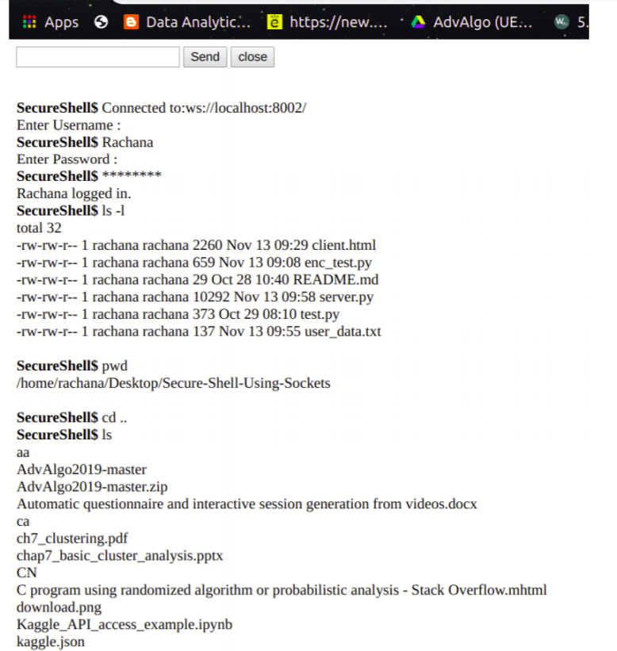

# Secure Shell Using WebSockets

Mock SSH using websockets with encryption.

**SSH**, also known as **Secure Shell**, is a network protocol that provides administrators with a secure
way to access a remote servers. SSH establishes a cryptographically secured connection between two
parties(client and server), authenticating each side to the other, and passing commands and output back and
forth.

For our project we have implemented a simple **SSH** using **websockets**, with the server written in Python
and the client in Javascript. User and password authentication is also implemented. The password is
encrypted before sending and hashed before storing.

### Network Concepts Used
1. Web sockets
2. Socket programming
3. Symmetric key encryption
4. Web socket handshaking

### Main Modules Developed
#### Server:
1) *feed* : To accept messages from the client and to perform TCP handshaking on first contact.
2) *sendMessage* : To send a message to the client
3) *validate_username* : To verify that the user is registered in the database
4) *validate_password* : To decrypt the password and to check if it matches with the hashed password stored in the database
5) *execute_command* : To execute the command sent by the client and prepare the output to be delivered.

#### Client:
6) *onSubmit* : To send the command entered by the user to the server. Also ensures encryption of the password before sending.
7) *onMessage* : To output the message sent by the server, that is the result of the command sent.

